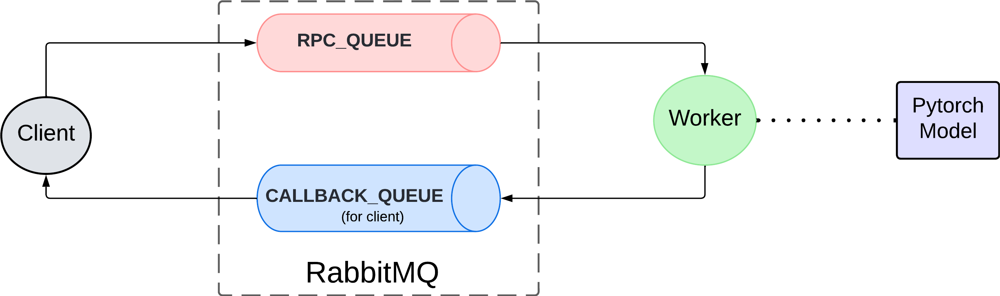

# Detection Queues

This project implements a distributed asynchronous architecture for the deployment of machine learning models.

## Architecture

1. Each client sends a request message to an `RPC_QUEUE` with their data. Additionally, each client will have its own `CALLBACK_QUEUE`
2. At some point, a worker will consume the request from the queue and run the data through the Pytorch model (torchscript).
3. The worker sends the result from the model to the client's `CALLBACK_QUEUE`.
4. The client is notified and consumes the response from the queue.



## Dependencies

- You need to have RabbitMQ installed or running it through a docker container.

```bash
docker run -it --rm --name rabbitmq -p 5672:5672 -p 15672:15672 rabbitmq:3.13-management
```

- A GPU with cuda support

## Installing

You need to have [poetry](https://python-poetry.org/docs/) installed.

- Setting the current folder as the path to a virtual environment:

  ```bash
  poetry config virtualenvs.in-project true
  ```

- Installing dependencies:

  ```bash
  poetry install
  ```

- Activating shell:

  ```bash
  poetry shell
  ```

## Running

With an **instance** of RabbitMQ **running**:

- Running a worker:

  ```bashh
  poetry run python rpc/rpc_server.py
  ```

- Running a client:

  ```bash
  poetry run python rpc/rpc_client.py
  ```

- Running tests:

  ```bash
  poetry run python tests/pytorch_model.py
  ```
